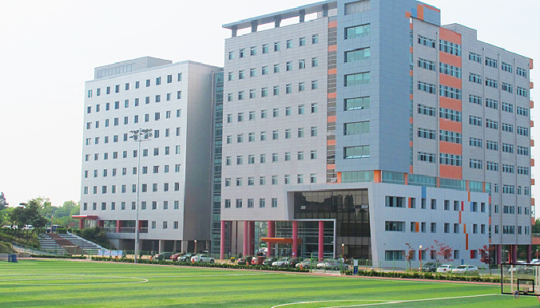
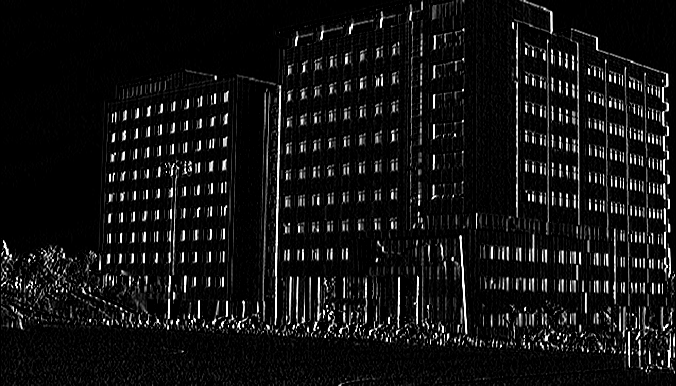
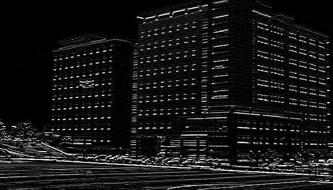

# filter2D 함수를 이용한 Filter 적용

1. Original image

2. Mean Filter

3. Weighted Mean Filter

4. Grayscale

5. Sobel_X

6. Sobel_Y

7. Sobel

8. Laplacian Filter

9. Laplacian Filter zero crossing without Gaussian filter

10. Laplacian Filter zero crossing with Gaussian filter

11. Enhanced Image with Laplacian Filter

